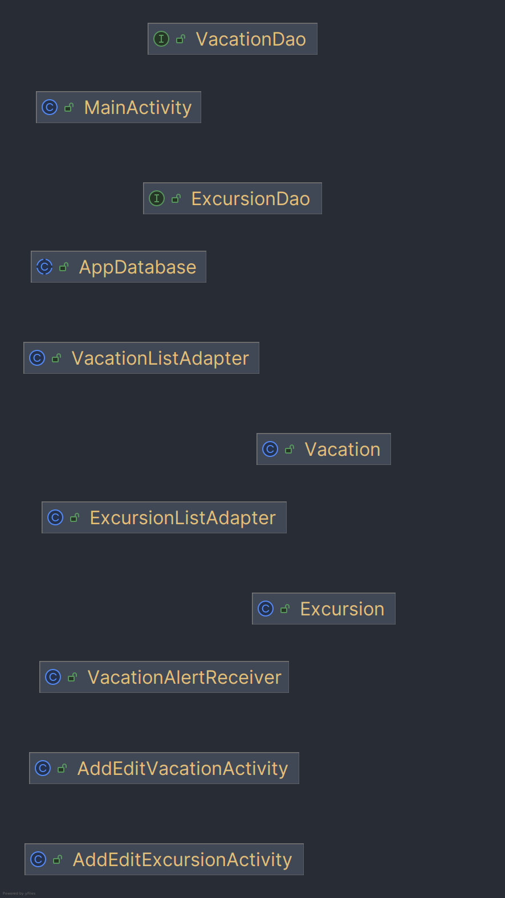

# EasyTrip Planner

## Overview

EasyTrip Planner is a native Android application designed to help users manage vacations and associated excursions. It allows for the creation of detailed itineraries, including start and end dates, accommodation details, and specific activities. The app leverages the Room Persistence Library for local data storage and integrates with Android's AlarmManager to provide timely notifications.

---

## Features

### Vacation Management
The core of the application revolves around vacation entities. Users can:
- **Create and Edit:** Add new vacations with titles, accommodation info, and date ranges.
- **Validation:** The app enforces data integrity, ensuring end dates occur after start dates and all required fields are populated.
- **Deletion:** Vacations can be removed from the database. To prevent accidental data loss, the app restricts deleting vacations that still have attached excursions.

### Excursion Tracking
Each vacation can include multiple excursions.
- **Scheduling:** Add excursions with specific dates.
- **Date Logic:** The system validates that excursion dates fall within the parent vacation's timeframe.
- **List View:** Excursions are displayed in a filtered list within the vacation detail screen.

### Alerts & Notifications
Users can set reminders for key dates.
- **Vacation Alerts:** Trigger notifications for the start and end of a trip.
- **Excursion Alerts:** Set individual reminders for specific activities.
- **Implementation:** Alerts are scheduled for 9:00 AM on the selected dates using `AlarmManager` and `BroadcastReceiver`.

### Sharing
The app includes a sharing feature that compiles a summary of the vacation, including the itinerary and excursions, which can be sent via standard Android sharing intents (Email, SMS, etc.).

---

## Technical Details

- **Platform:** Android
- **Data Persistence:** Room Database (SQLite)
- **Minimum SDK:** API 26 (Android 8.0)
- **Target SDK:** API 36

---

## Continuous Deployment

The project includes a CI/CD pipeline configured via GitHub Actions to automate the build process.
- **Workflow File:** `.github/workflows/android-build.yml`
- **Triggers:** Pushes to the `main` branch or manual workflow dispatch.
- **Artifacts:** Successfully building the project generates a release APK, which is uploaded as a workflow artifact.

---

## Setup and Installation

1.  **Prerequisites:** An Android device or emulator running API Level 26 or higher.
2.  **Installation:** Install the signed APK.
3.  **Launch:** Open the app to land on the main Vacations List.

---

## Visuals

### Storyboard

### Class Diagram

---

**Author:** Mason Wilcox 
**Date:** 2025-11-20 
**Version:** 1.0 
**License:** MIT